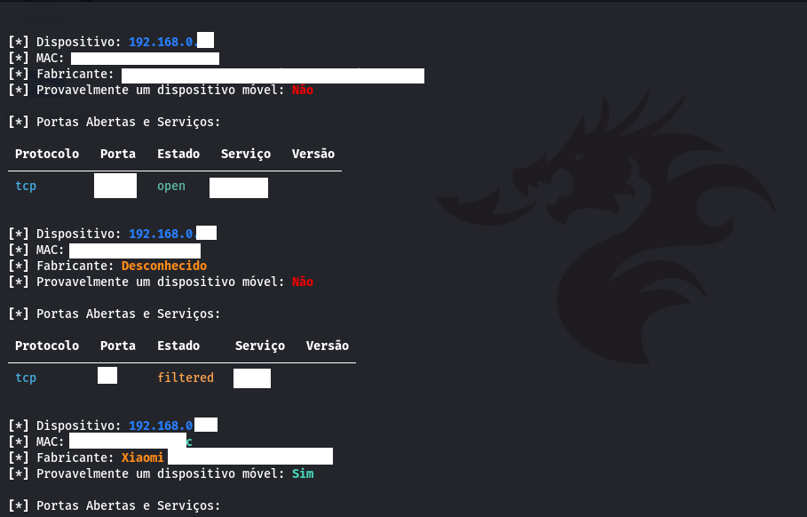

```markdown
# DraculNS



## Descrição

O DraculNS é um script em Python3 desenvolvido para realizar varreduras de portas em uma rede. Ele foi projetado para facilitar a identificação de dispositivos e serviços presentes na rede.

Este script utiliza técnicas de varredura TCP para identificar portas abertas nos dispositivos da rede. Além disso, o DraculNS também é capaz de obter informações sobre os serviços encontrados nas portas, incluindo suas versões. Essas informações podem ser úteis para entender melhor a configuração e o estado dos dispositivos na rede.

## Requisitos

Para executar o DraculNS, você precisará:

1. Python 3 instalado em seu sistema.

```bash
apt-get install python3
```

2. Pacotes Python específicos. Estes podem ser instalados através do pip, o gerenciador de pacotes do Python. A lista de pacotes necessários inclui:

   * argparse
   * nmap
   * ipaddress
   * time
   * schedule
   * scapy
   * mac_vendor_lookup
   * rich


Para instalar todos esses pacotes, você pode utilizar o seguinte comando:

```bash
pip install argparse nmap ipaddress scapy mac_vendor_lookup rich time schedule
```

Caso você tenha alguma dificuldade, tente atualizar o pacote aiohttp

```bash
sudo pip3 install --upgrade aiohttp
```

## Como usar

Siga estas etapas para usar o DraculNS:

1. Baixe o script do meu repositório do GitHub ou clone-o em seu ambiente de trabalho local.

```bash
wget https://raw.githubusercontent.com/seu_usuario/seu_repositorio/main/seu_script.py
```

2. Altere as permissões do script para torná-lo executável. Você pode fazer isso com o comando `chmod`:

```bash
chmod +x seu_script.py
```

3. Execute o script com privilégios de superusuário. Isso é necessário porque a varredura de rede precisa desses privilégios. Use o comando `sudo`:

```bash
sudo python3 draculns.py
```

Por padrão, o DraculNS realiza a varredura na rede '192.168.0.0/24' através da interface 'eth0'. Se você quiser especificar uma rede ou interface diferentes, pode usar as opções '-ip' e '-i':

```bash
sudo python3 draculns.py -ip 10.0.2.0/24 -i wlan0
```

Se quiser que a varredura seja realizada periodicamente (a cada 1 minuto), adicione a opção '-l':

```bash
sudo python3 draculns.py -l
```

## Contribuições

Ajude comprando nosso aplicativo de Google Hacking que disponibiliza dorks específicas para pentesting, mais informaçãoes em:

https://play.google.com/store/apps/details?id=com.gdraculdorksmobile&pli=1

## Autor

- Autor: Seu Nome
- GitHub: [Seu Perfil no GitHub](https://github.com/fabiosilvamonteiro)
- LinkedIn: [Seu Perfil no LinkedIn](https://www.linkedin.com/in/fabio-silva-monteiro/)

## Aviso Legal

Este script foi criado para fins educacionais e de teste. Qualquer uso indevido deste script, incluindo atividades ilegais, é estritamente proibido. Não me responsabilizo por qualquer uso indevido deste script. Utilize-o de maneira ética e responsável.

```
